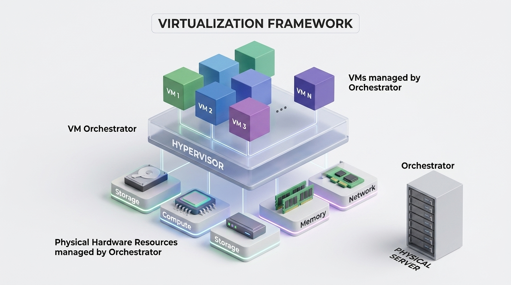
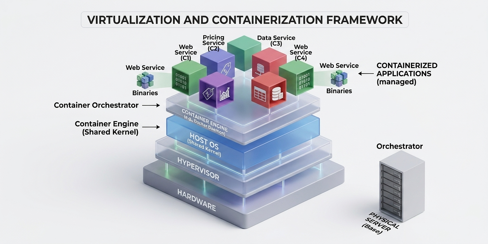
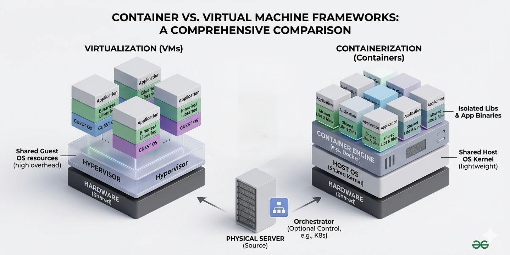
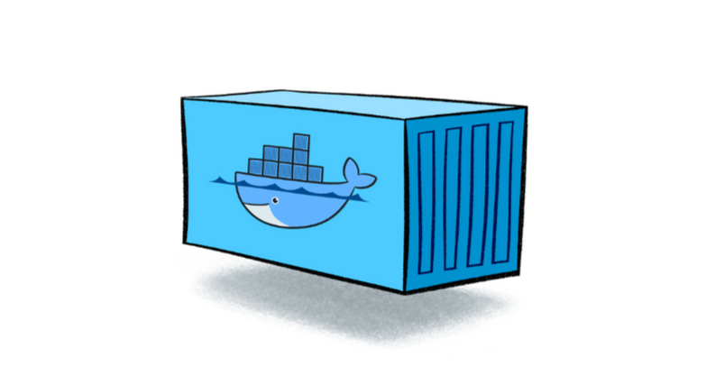
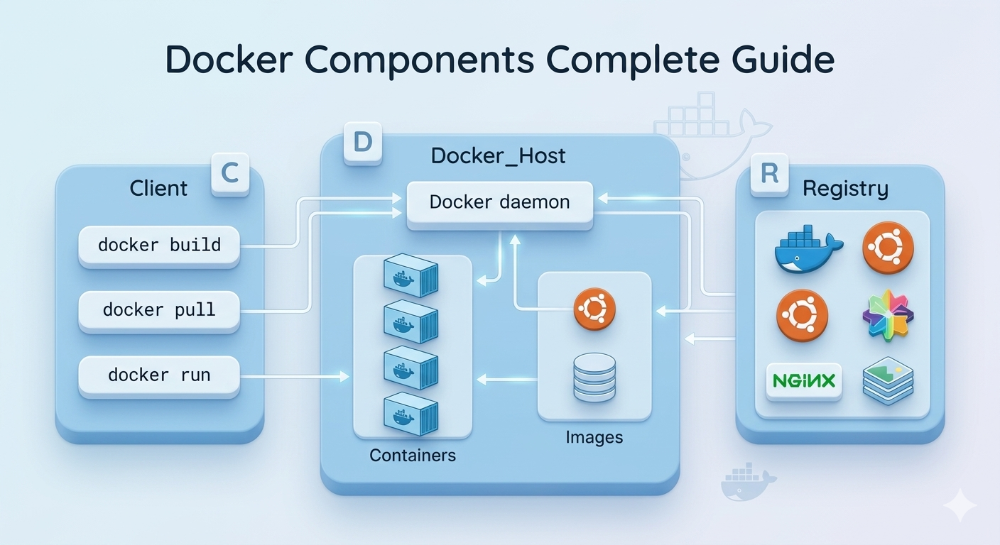

# Docker Fundamentals — Day 1

## Introduction to Docker

---

## 1. Why Do We Need Containers?

Picture this: You spend three days building a Node.js app on your laptop. Everything works perfectly — tests pass, the app runs smoothly, you're feeling great. Then you hand it off to your teammate, they run it on their machine, and... it breaks. Or worse, it works on their machine too, but the moment you deploy it to the production server, it explodes with a bunch of cryptic errors.

Sound familiar? This is the classic **"it works on my machine"** problem, and it has haunted developers for decades.

Modern software applications don't run in a vacuum. They depend on a whole ecosystem of things:

- A specific version of a programming language runtime (Node.js 18? Python 3.11? Java 17?)
- Libraries and packages with their own version requirements
- Environment variables and system configurations
- Sometimes even operating system-level dependencies

The moment any one of these things differs between environments — your laptop, your teammate's laptop, the staging server, the production server — you're in trouble. You get dependency conflicts ("this library needs version 2.x, but you have version 3.x installed"), version mismatches, and baffling bugs that only appear in certain environments.

The fundamental problem is this: **applications are not being shipped along with the environment they need to run in.** You ship the code, but not the context.

Containers solve this. They let you package your application _together_ with everything it needs to run — the runtime, the libraries, the config — into a single portable unit. That unit behaves identically everywhere it runs. Your laptop, your teammate's machine, the cloud server — same result, every time.

But before we get into containers, let's look at the solution that came before them: Virtual Machines.

---

## 2. Virtual Machines (VMs)



A **Virtual Machine** is exactly what the name suggests — a machine that's virtual. It's software that pretends to be a physical computer. Using a piece of software called a **hypervisor** (examples: VMware, VirtualBox, Hyper-V), you can carve up one physical machine into several independent virtual machines, each acting like a completely separate computer.

Here's what the architecture looks like, from bottom to top:

```
┌─────────────────────────────────────────┐
│         Application (e.g. your app)     │
├─────────────────────────────────────────┤
│         Guest OS (e.g. Ubuntu)          │
├─────────────────────────────────────────┤
│   Hypervisor (VMware / VirtualBox)      │
├─────────────────────────────────────────┤
│         Host OS (e.g. Windows)          │
├─────────────────────────────────────────┤
│         Physical Hardware               │
└─────────────────────────────────────────┘
```

Each VM gets its own full operating system — kernel, drivers, system libraries, everything. This gives you incredibly strong **isolation**. What happens inside one VM has zero effect on another VM on the same host.

### The Upside

VMs did a great job of solving the environment consistency problem. If you need your app to run on Ubuntu, you spin up an Ubuntu VM and ship that. Every developer can work in identical VM environments. The ops team can run the same VM on production servers.

### The Downside

The problem is that VMs are _heavy_. Here's why:

- **Every VM carries a full OS.** If you need to run 5 different apps, you might have 5 copies of Ubuntu sitting on your machine, each consuming gigabytes of disk space and hundreds of MB of RAM just to exist.
- **Startup time is slow.** Booting a VM is like booting a real computer — it can take minutes.
- **Resource overhead is significant.** The hypervisor layer eats into your CPU and memory before your actual application even gets a chance to run.

Imagine you're a restaurant. VMs are like building a brand new, fully staffed kitchen for every single dish you want to serve. Technically it works — every dish comes out perfect — but it's wildly inefficient.

There had to be a better way.

---

## 3. Containers



Containers take a completely different approach. Instead of virtualizing the hardware (pretending to be a separate computer), containers **virtualize at the operating system level**. They share the host machine's OS kernel but create isolated spaces — called containers — where applications can run as if they were alone on the system.

Here's what the architecture looks like:

```
┌─────────────┬─────────────┬─────────────┐
│  Container  │  Container  │  Container  │
│   (App A)   │   (App B)   │   (App C)   │
├─────────────┴─────────────┴─────────────┤
│         Container Runtime (Docker)      │
├─────────────────────────────────────────┤
│         Host OS (Shared Kernel)         │
├─────────────────────────────────────────┤
│         Physical Hardware               │
└─────────────────────────────────────────┘
```

Notice what's _missing_ compared to the VM diagram: there's no hypervisor, and there's no Guest OS inside each container. All three containers share the same underlying OS. This is what makes containers so lightweight and fast.

Going back to our restaurant analogy — containers are like having one shared kitchen but with separate workstations for each chef. Each chef has their own tools, their own ingredients, their own space. They can't mess with each other's workstations. But they're all using the same kitchen infrastructure, which is far more efficient than building separate kitchens.

### What's Inside a Container?

A container packages:

- Your **application code**
- The **runtime** it needs (e.g., Node.js, Python)
- All **libraries and dependencies**
- **Configuration files** and environment variables

Everything your app needs to run, bundled together. Nothing more, nothing less.

### Key Characteristics

- **Lightweight:** Containers are measured in megabytes, not gigabytes. Without the full OS overhead, they're tiny.
- **Fast to start:** Since there's no OS to boot, containers start in seconds — often in milliseconds.
- **Efficient:** Multiple containers share the same OS kernel, so resources aren't wasted on redundant OS copies.
- **Portable:** A container built on your MacBook will run identically on a Linux server in a data center. The environment is baked in.

---

## 4. Containers vs Virtual Machines — Side by Side



Let's put everything we've learned into a direct comparison:

| Feature            | Virtual Machines                                      | Containers                                            |
| ------------------ | ----------------------------------------------------- | ----------------------------------------------------- |
| **OS**             | Each VM runs a full, separate OS                      | All containers share the host OS kernel               |
| **Size**           | Large — typically gigabytes per VM                    | Small — typically megabytes per container             |
| **Startup Time**   | Slow — minutes to boot                                | Fast — seconds (sometimes milliseconds)               |
| **Performance**    | Lower due to hypervisor overhead                      | Near-native performance                               |
| **Resource Usage** | High — RAM, CPU, and disk for each OS                 | Low — shared kernel, minimal overhead                 |
| **Isolation**      | Strong — completely separate OS per VM                | Process-level isolation (good, not quite as absolute) |
| **Portability**    | Moderate — large, slow to transfer                    | High — lightweight, fast to push and pull             |
| **Best For**       | Running different OS types, strong security isolation | Microservices, scalable applications, CI/CD           |

### The One-Line Mental Model

> **VMs virtualize hardware. Containers virtualize the operating system.**

A VM says: "Pretend you're a whole separate computer." A container says: "You get your own isolated space on this computer, but we'll share the underlying OS."

### When Would You Still Use a VM?

Containers are great, but they're not always the right tool. You'd still reach for a VM when:

- You need to run a completely different OS (e.g., running Windows on a Linux host)
- You need maximum, hardware-level isolation for security reasons (e.g., multi-tenant cloud infrastructure)
- Your application has kernel-level requirements that need a dedicated OS

In practice, modern cloud infrastructure often _combines_ both — VMs provide the base isolation layer, and containers run inside those VMs for application-level efficiency. You get the security of VMs and the agility of containers.

---

## 5. What is Docker?



Now that we understand why containers exist and what problems they solve, let's talk about **Docker** — the tool that made containers mainstream.

Docker is an open-source platform that makes it easy to **build, ship, and run applications inside containers**. Before Docker (released in 2013), containers were technically possible using Linux kernel features like cgroups and namespaces, but working with them directly was complex and required deep Linux expertise.

Docker changed everything by wrapping all that complexity in a clean, developer-friendly toolset. Suddenly, any developer — not just a Linux kernel expert — could package their application into a container and run it anywhere.

Think of Docker as the infrastructure around containers. If a container is a shipping crate, Docker is the entire port system — the cranes, the trucks, the manifest system, the whole operation that makes shipping those crates reliable and predictable.

Docker provides:

- A way to **define** what goes into a container (using a `Dockerfile`)
- A way to **build** container images from that definition
- A way to **run, stop, start, and manage** containers
- A way to **share** container images through registries like Docker Hub

---

## 6. Core Docker Components

To work effectively with Docker, you need to understand three key concepts that build on each other: Images, Containers, and the Docker Engine.


### 6.1 Docker Image

A **Docker Image** is a read-only template — a snapshot of everything your application needs to run. Think of it like a recipe or a blueprint. The image itself doesn't _do_ anything. It just describes what a running container should look like.

An image contains:

- A base operating system layer (e.g., a minimal Ubuntu or Alpine Linux)
- Your application's runtime (e.g., Node.js 18, Python 3.11)
- Your application's dependencies (e.g., npm packages, pip packages)
- Your actual application code
- Any configuration needed at startup

Images are built in **layers**, which is one of Docker's most clever design decisions. Each instruction in a Dockerfile adds a new layer on top of the previous ones. Layers that haven't changed are cached — so if you change only your app code, Docker only rebuilds the app code layer, not the entire image. This makes builds fast.

You define an image by writing a `Dockerfile`. Here's a simple example of what one looks like for a Node.js app:

```dockerfile
# Start from an official Node.js base image
FROM node:18-alpine

# Set the working directory inside the container
WORKDIR /app

# Copy package files and install dependencies
COPY package*.json ./
RUN npm install

# Copy the rest of your application code
COPY . .

# Tell Docker which port the app listens on
EXPOSE 3000

# The command to run when the container starts
CMD ["node", "server.js"]
```

When you build this Dockerfile, you get a Docker Image. Every time you run that image, you get a container.

### 6.2 Docker Container

A **Docker Container** is a running instance of a Docker Image. This is where the action actually happens.

The relationship works like this:

```
Dockerfile  →  (docker build)  →  Image  →  (docker run)  →  Container
  (recipe)                     (blueprint)                  (actual app)
```

You can run multiple containers from the same image simultaneously. It's like a cookie cutter (the image) and cookies (the containers). One cutter, unlimited cookies.

Each container is:

- **Isolated** — it has its own filesystem, network interfaces, and process space
- **Ephemeral by default** — when you stop and remove a container, its writable layer disappears (unless you use volumes to persist data)
- **Fast to create** — spinning up a new container from an existing image takes seconds

### 6.3 Docker Engine

The **Docker Engine** is the core runtime that sits on your machine and makes all of this possible. It's a background service (a daemon) that:

- Listens for Docker commands (via the Docker CLI)
- Builds images from Dockerfiles
- Runs and manages containers
- Handles networking between containers
- Manages storage and volumes

When you type `docker run nginx` in your terminal, you're talking to the Docker CLI, which sends instructions to the Docker Engine, which then pulls the nginx image (if you don't have it locally), creates a container from it, and starts it. All of that happens transparently.

---

## 7. How Docker Solves Real Problems

Let's bring this back to earth with some concrete scenarios.

### The "Works on My Machine" Problem

**Before Docker:** Developer A builds a Python app on macOS using Python 3.11 and a specific version of a library. Developer B tries to run it on Windows with Python 3.9 and a different library version. Chaos ensues. The ops team has to spend hours matching the production environment to the development environment. Nobody is happy.

**After Docker:** Developer A writes a Dockerfile that specifies Python 3.11 and the exact library versions. They build an image. That image is the environment. Developer B runs the exact same image. The ops team deploys the exact same image to production. Everyone runs the same thing. The "works on my machine" problem is gone — because everyone is using the same machine (the container).

### Onboarding a New Developer

**Before Docker:** New hire joins the team. They spend their first two days following a 20-step "environment setup guide" that's six months out of date. Three tools don't install correctly on their OS. They ask five different people for help. They finally get a working environment on day three.

**After Docker:** New hire clones the repo, runs `docker compose up`, and the entire application stack (app server, database, cache) is running in minutes. They write their first PR on day one.

### Scaling an Application

**Before Docker:** App gets popular, you need 10 instances of your web server. Each one needs to be manually provisioned, configured, and updated. Any configuration drift between instances causes mysterious bugs.

**After Docker:** You run `docker run my-app` ten times (or use an orchestrator like Kubernetes to do it automatically). Each instance is identical because they all come from the same image.

### CI/CD Pipelines

Docker is a natural fit for continuous integration and deployment. Your test pipeline can spin up a fresh container for each test run, run the tests in a clean, identical environment, and tear it down. No leftover state from previous runs. No "flaky tests" caused by environment differences.

---

## 8. Summary

We covered a lot of ground here. Let's consolidate it:

The fundamental problem Docker solves is **environment inconsistency** — the fact that software behaves differently depending on where it runs. This problem exists because traditionally, you ship your code but not the environment your code needs.

**Virtual Machines** were the first major solution to this problem. They create fully isolated, software-defined computers — each with their own OS. They work well but are heavy, slow to start, and resource-intensive.

**Containers** are the modern solution. They package your application and its dependencies into a lightweight, portable unit that shares the host OS kernel. They're fast, efficient, and portable.

**Docker** is the platform that made containers practical for everyday developers. It provides the tooling to build images, run containers, and manage the whole lifecycle of containerized applications.

The key conceptual chain to remember is:

```
Dockerfile → Image → Container
(instructions)  (blueprint)  (running app)
```

And the key mental model for containers vs VMs:

```
VMs = Virtualize hardware (each gets its own OS)
Containers = Virtualize the OS (each gets its own isolated process space)
```

Containers are now the backbone of modern software deployment. Whether you're using AWS, Google Cloud, or running your own servers, there's a very good chance containers are involved. Kubernetes, Docker Compose, CI/CD pipelines, microservices architectures — all of these are built on top of the container foundation you just learned about.

---

## 9. What's Next

Now that you understand the _why_ and _what_ of Docker, Day 2 is all about getting your hands dirty.

Here's what we'll cover next:

- **Installing Docker** on Windows, macOS, and Linux — including the gotchas and common issues
- **Running your first container** with `docker run hello-world` and understanding what just happened
- **Essential Docker CLI commands** — `docker pull`, `docker run`, `docker ps`, `docker stop`, `docker rm`, and more
- **Writing your first Dockerfile** and building a real image from scratch
- **Understanding port mapping** — how traffic gets from your machine into a container

---

> 💡 **Quick Recap Quiz** — test yourself before moving on:
>
> 1. What problem do containers solve?
> 2. What's the difference between a Docker Image and a Docker Container?
> 3. In one sentence: how do containers differ from VMs?
> 4. What does the Docker Engine do?

_(Answers are all in this document — scroll up if you need a refresher!)_
